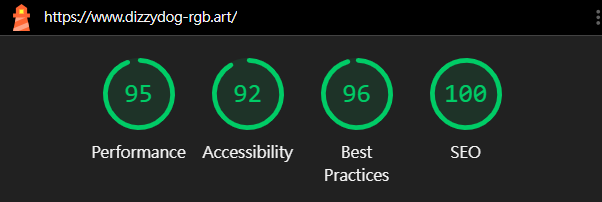

# Jackie's Portfolio 🚀
[](https://vuejs.org/)
[](https://greensock.com/gsap/)
[](https://vitejs.dev/)
[](https://opensource.org/licenses/MIT)

> **"Seamless Interaction & High-Performance Engineering."**  
> 一個追求極致視覺互動效果與高性能網頁架構的個人網站專案。

##### 本專案在實現複雜 GSAP 滾動動畫與視差效果的同時，依然維持了頂尖的效能表現。



---

## 🌟 核心定位與價值 (Core Philosophy)

*   **Dynamic Interactive Experience**：專注於高流暢度的視覺互動體驗，使用 GSAP 打造順暢的動態轉場與滾動視差效果。
*   **Engineering Excellence**：不只是「實現畫面」，而是建構具備可維護性及高效能的 Web 應用，專注於代碼的整潔與架構的合理性。

## 🛠️ 技術棧與工程實踐 (Technical Highlights)

### 1. 前端架構 (Frontend Excellence)
*   **Vue 3 (Composition API)**：實踐組件化開發，將 UI 表現層與業務邏輯解耦。
*   **GSAP + ScrollTrigger**：高階動態狀態管理，處理複雜的 DOM 監聽與滾動觸發動畫。
*   **資源生命週期管理**：利用 `gsap.context()` 實作動畫自動清理機制，徹底杜絕 **記憶體洩漏 (Memory Leaks)**。

### 2. 前端工程化與運維實踐 (Frontend Infrastructure & DevOps)
*   **GitHub API 整合**：透過非同步請求實時串接 Commit 數據，動態展現開發活躍度。
*   **Vite 構建優化與自動化部署**：
    * 利用 Vite 的 `base` 路徑配置與打包策略，確保靜態資源在 GitHub Pages 絕對路徑下的正確加載。
    * 實作 **`npm run deploy` 自定義腳本**，整合 `gh-pages` 模組達成一鍵自動化部署，提升開發迭代效率。
*   **Cloudflare 邊緣運算優化**：
      * 配置 Cloudflare DNS 託管與 **SSL/TLS (Full Mode)** 安全加密。
      * **SPA 路由解決方案**：實作 `404.html` 重定向機制解決 HTML5 History Mode 刷新 404 問題，確保網址美觀且具備 Production-Ready 的穩定性。

## 📈 效能優化指標 (Performance Audit)

本專案在 Lighthouse 測試中達到近乎滿分的成績，展現了對細節的掌控力：

*   **Performance (95+)**：實作圖片 WebP 格式轉換、Lazy Loading 與 CSS GPU 加速渲染，並成功解決 SPA 專案常見的路由加載瓶頸。
*   **Accessibility (92+)**：全面採用語意化 HTML 標籤（如 `<section>`、`<nav>`、`<figure>`）確保清晰的文檔大綱結構，並搭配精確的圖片 `alt` 敘述，提供螢幕閱讀器友善的資訊導覽體驗。
*   **Best Practices / SEO (96 / 100)**：配置強大的安全性政策 (CSP, HSTS)，並達成 Meta Data 與索引結構的全方位優化。

---

## 💡 問題解決案例 (Case Study)

### **挑戰：複雜 GSAP 滾動動畫導致 FPS 掉幀**
在實作高頻率滾動觸發動畫（如 Hero Section 的多層級視差效果）時，發現部分裝置出現明顯的掉幀與渲染卡頓現象，影響使用者體驗。

### **解決方案：**
1.  **開啟硬體加速**：透過 `will-change: transform` 屬性通知瀏覽器預先優化，將動畫渲染負擔從 CPU 轉移至 **GPU 硬體加速**。
2.  **優化刷新頻率**：精確調校 `ScrollTrigger` 的 `refresh` 頻率，並利用 `scrub` 平滑插值技術減少主線程運算壓力。
3.  **最終成果**：
    *   成功將動畫維持在穩定的 **60FPS**。
    *   大幅提升 **Lighthouse 效能評分** 至 90+ 高標。
    *   確保在低配備裝置上依然保有流暢的滾動視覺。

---

## 🗺️ 未來演進藍圖 (Future Roadmap)

*   **數據導向**：整合 Google Analytics 進行使用者行為分析，作為後續 UI/UX 迭代的量化依據。。
*   **高效能組件庫 (Component Library)**：規劃利用 Astro 重構 Library 分頁，實踐「零 JavaScript 載入」的靜態渲染，並以高效能展示精密細緻的按鈕、卡片 hover 互動特效。

## 🚀 快速開始 (Quick Start)

```bash
npm install
npm run dev
npm run build
npm run deploy
```

## 📬 聯絡資訊 (Contact)

*   **Live Demo**: [www.dizzydog-rgb.art](https://www.dizzydog-rgb.art)
*   **LinkedIn**: [Yi-Sheng Chen (Jackie)](https://www.linkedin.com/in/yi-sheng-chen-jackie)
*   **GitHub**: [@dizzydog-rgb](https://github.com/dizzydog-rgb)
*   **Email**: [yisheng.chen.jackie@gmail.com](mailto:yisheng.chen.jackie@gmail.com)
*   **CodePen**: [My Collection](https://codepen.io/collection/zzGkOR)

---
Copyright © 2026 Jackie Chen. Built with 💻 and precision.
